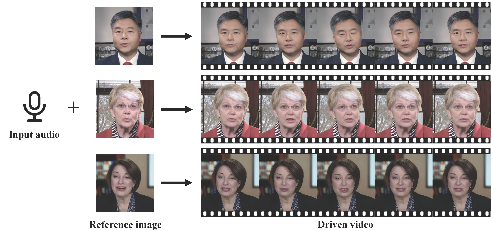

# VividTalk
VividTalk: One-Shot Audio-Driven Talking Head Generation Based on 3D Hybrid Prior

[Xusen Sun](https://dblp.org/pid/308/0824), [Longhao Zhang](https://scholar.google.com/citations?user=qkJD6c0AAAAJ&hl=zh-CN), [Hao Zhu](http://zhuhao.cc/home/), [Peng Zhang](https://scholar.google.com/citations?user=QTgxKmkAAAAJ&hl=zh-CN), [Bang Zhang](https://dblp.org/pid/11/4046.html), [Xinya Ji](https://dblp.org/pid/290/1747), [Kangneng Zhou](https://scholar.google.com.hk/citations?user=y1vvxWYAAAAJ&hl=zh-CN), [Daiheng Gao](https://tomguluson92.github.io/), [Liefeng Bo](https://scholar.google.com/citations?user=FJwtMf0AAAAJ&hl=zh-CN), [Xun Cao](https://scholar.google.com/citations?user=8hZIngIAAAAJ&hl=zh-CN&oi=ao)

<a href='https://humanaigc.github.io/vivid-talk/'></a> <a href='https://arxiv.org/pdf/2312.01841.pdf'></a> [](https://www.youtube.com/watch?v=lJVzt7JCe_4)



## Citation	

```
@article{sun2023vividtalk,
  title     = {VividTalk: One-Shot Audio-Driven Talking Head Generation Based 3D Hybrid Prior},
  author    = {Xusen Sun, Longhao Zhang, Hao Zhu, Peng Zhang, Bang Zhang, Xinya Ji, Kangneng Zhou, Daiheng Gao, Liefeng Bo, Xun Cao},
  journal   = {arXiv preprint arXiv:2312.01841},
  website   = {https://humanaigc.github.io/vivid-talk/},
  year      = {2023},
```
